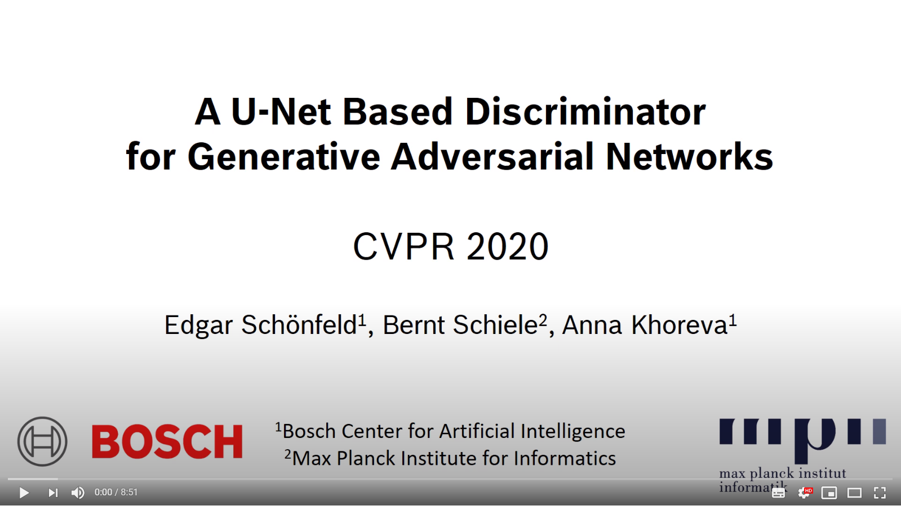

# U-Net GAN PyTorch

<p align="center">

</p>

PyTorch implementation of the CVPR 2020 paper "A U-Net Based Discriminator for Generative Adversarial Networks". The paper and supplementary can
be found [here](https://openaccess.thecvf.com/content_CVPR_2020/html/Schonfeld_A_U-Net_Based_Discriminator_for_Generative_Adversarial_Networks_CVPR_2020_paper.html). Don't forget to have a look at the supplementary as well (the Tensorflow FIDs can be found there (Table S1)). The code allows the users to reproduce and extend the results reported in the study. Please cite the
above paper when reporting, reproducing or extending the results.


## Setup

Create the conda environment "unetgan" from the provided unetgan.yml file. The experiments can be reproduced with the scripts provided in the folder training_scripts (the experiment folder and dataset folder has to be set manually).


|Argument|Explanation|
|----------------------------------------- |-------------------------------------------------------------|
|```--unconditional```                     | Use this if the dataset does not have classes <br />(e.g. CelebA).|
|```--unet_mixup```                        | Use CutMix.                                                 |
|```--slow_mixup```                        | Use warmup for the CutMix-augmentation loss.                |
|```--slow_mixup_epochs```                 | Number of epochs for the warmup                             |
|```--full_batch_mixup```                  | If True, a coin is tossed at every training step. <br />  With a certain probability the whole batch is mixed <br /> and the CutMix augmentation loss and consistency loss <br /> is the only loss that is computed for this batch. The <br /> probability increases from 0  to 0.5 over the course <br />  of the specified warmup epochs. If False, the CutMix <br /> augmentation and consistency loss are  computed for  <br /> every batch and added to the default GAN loss. In the <br /> case of a warmup, the augmentation loss is multiplied <br /> with a factor that increases from 0 to 1 over the course <br /> of  the specified warmup epochs.|
|```--consistency_loss```                  | Compute only the CutMix consistency loss, but not the <br /> CutMix augmentation loss  (Can increase stability but<br /> might perform worse). |
|```--consistency_loss_and_augmentation```  | Compute both CutMix augmentation and consistency <br />loss.|
|```--base_root```                         | Specify the path/to/folder_for_results where all <br />experimental results are saved. |
|```--data_folder```                       | Specify the path to the dataset /path/to/dataset. For FFHQ, <br />this folder contains the 69 subfolders that can be <br />downloaded [here](https://drive.google.com/drive/folders/1tZUcXDBeOibC6jcMCtgRRz67pzrAHeHL). In our case, the images were <br />downscaled before training to resolution 256x256. <br />For CelebA, the folder should contain all images with their <br />6-digit number as file name (e.g. 016685.png) |


## Details

This implementation of U-Net GAN is based on the PyTorch code for BigGAN (https://github.com/ajbrock/BigGAN-PyTorch). The main differences are that (1) we use our own data-loader which does not require HDF5 pre-processing, (2) applied changes in the generator and discriminator class in BigGAN.py, and (3) modified train.py and train_fns.py. If you want to turn your own GAN into a U-Net GAN, make sure to follow the tips outlined in [how_to_unetgan.pdf](https://github.com/boschresearch/unetgan/blob/master/how_to_unetgan.pdf).

## Graphical Overview of the U-Net Discriminator Architecture

<p align="center">

</p>

## Video Summary
[](https://www.youtube.com/watch?v=BR9C4p3W9vw)

## Metrics

The inception metrics (FID and IS) are measured in the same way as in the parent repository (https://github.com/ajbrock/BigGAN-PyTorch). They can be computed on-the-fly during training, using the pre-computed inception moments (see original BigGAN repository). We included the pre-computed inception moments for CelebA and FFHQ in this repository for convenience. This means when the model trains it will automatically read the npz files in the main folder and calculate the FID. The on-the-fly FID scores are saved in the ```logs``` folder in the output directory as a pickle named ```inception_metrics_<experiment_name>.p```. Note that for CelebA training is perfectly stable, but for FFHQ we observe frequent collapse (which is also the case for the underlying BigGAN, which is unstable for FFHQ). The FID curve for a successful FFHQ run will look like the one on the left, while the more common failed runs will look like the curve on the right. The collapse occurs early in training and is easily detectable (in contrast, for BigGAN it usually occurs later).

<p align="center">

</p>

## Pretrained Model

To load the pre-trained model for FFHQ, execute ```sh training_scripts/load_pretrained_ffhq.sh```. The script will load the checkpoint and resume training from this point. Of course, you still need to set the path to the dataset and the desired output folder in this script. If you quickly want to check the outputs of the pre-trained model, set te ```--sample_every``` to a small number of training steps, like 30.

## Citation
If you use this work please cite
```
@inproceedings{schonfeld2020u,
  title={A u-net based discriminator for generative adversarial networks},
  author={Schonfeld, Edgar and Schiele, Bernt and Khoreva, Anna},
  booktitle={Proceedings of the IEEE/CVF Conference on Computer Vision and Pattern Recognition},
  pages={8207--8216},
  year={2020}
}
```

## License

U-Net GAN PyTorch is open-sourced under the AGPL-3.0 license. See the
[LICENSE](LICENSE) file for details.

For a list of other open source components included in unetgan, see the
file [3rd-party-licenses.txt](3rd-party-licenses.txt).

## Purpose of the project

This software is a research prototype, solely developed for and published as
part of the publication. It will neither be
maintained nor monitored in any way.

## Contact
If you have questions or need help, feel free to write an email to edgarschoenfeld@live.de.
